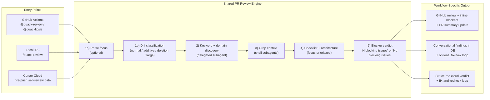

#AI agents that generate code and AI agents that test it - How we use AI at QA.tech
## DevQOps Sthlm - February 18
Everything I am showing you today is available in this Github repo.


### My name is Olle Pridiuksson - Solutions Engineer at agentic AI startup QA.tech
Talk to me if you're interested in agentic AI adoption and Quality Assurance strategy for your business.

- LinkedIn: <https://www.linkedin.com/in/pridiuksson>  
- Instagram: <https://www.instagram.com/pridiuksson>  
- Twitter: <https://x.com/pridiuksson>  

## Two PR Review Systems: Code Review vs E2E QA.tech Agent

There are **two distinct PR review systems** that can run on the same PR. They complement each other; neither replaces the other.

### What Each Does

| System                          | Role               | Primary question                                      |
| ------------------------------- | ------------------ | ----------------------------------------------------- |
| **Code Review**   | Static analysis    | Is the code safe, correct, and architecturally sound? |
| **E2E QA.tech PR Review Agent** | Behavioral testing | Does the user-facing functionality work?              |

**Code Review** uses grep, file reads, architecture references, and checklists. It does **not** run or create tests. It surfaces blockers (security, logic, types, architecture) before merge.

### Code Review

All three paths run the same review methodology (focus -> diff classification -> keywords/domains via subagent -> grep context -> focus-prioritized checklist -> architecture review), but they optimize for different moments:


| Workflow           | Trigger                                                      | Primary Goal                                      | Output                                                 |
| ------------------ | ------------------------------------------------------------ | ------------------------------------------------- | ------------------------------------------------------ |
| **GitHub Actions** | PR comment/review contains `@quack-review` | Autonomous PR review in GitHub                    | GitHub review + inline comments + PR summary refresh   |
| **Local IDE**      | Developer runs `/quack-review`                               | Interactive WIP review while coding               | Conversational findings + optional fix loop            |
| **Cursor Cloud**   | Agent pre-push checklist in cloud                            | Autonomous self-review before lint/typecheck/push | Structured verdict + findings for fix-and-recheck loop |


**E2E QA.tech Agent** runs on the QA.tech platform (Inngest). It fetches PR metadata and diffs, maps changes to features, selects or creates E2E tests, runs them against the PR preview deployment, and writes a GitHub review based on pass/fail. It does **not** do security, architecture, or code-quality review.

### How They Differ

| Dimension          | Code Review                                          | E2E QA.tech Agent                                               |
| ------------------ | ---------------------------------------------- | --------------------------------------------------------------- |
| **Review type**    | Structural (is it safe/correct?)               | Behavioral (does it work?)                                      |
| **Primary input**  | PR diffs + full codebase + architecture        | PR metadata + diffs + deployments                               |
| **Code access**    | Diffs + grep + file reads + architecture index | Diffs (patches), PR description, commits — no full repo or grep |
| **Test execution** | No                                             | Yes — runs E2E on PR preview                                    |
| **Runs where**     | Cursor IDE, GitHub Actions, Cursor Cloud       | QA.tech SaaS (Inngest)                                          |
| **Trigger**        | `@quack-review`, `/quack-review`, pre-push     | Deployment webhook, `@QA.tech` mention                          |

### How They Interconnect

When Quack runs in **GitHub Actions** and finishes its review, it may post a PR comment tagging `@QA.tech` with E2E-testing hints (Step 8.5). That comment triggers the `github/mention` Inngest event; the E2E agent receives the comment body as its prompt and can use those hints to improve test selection or creation.

**When Quack tags E2E:** Only when Quack has **useful** hints — information the E2E agent cannot infer from PR description, file paths, and patches alone (e.g. `packages/mcp/` and `packages/chat/` map to in-app chat; migrations touch project flows; Inngest runs when user saves settings). Quack does **not** tag when hints would be redundant or when it has nothing useful to add.

**Flow:**

```
Quack (GHA) finishes review
  → If useful E2E hints: gh pr comment @QA.tech + hints
  → github/mention Inngest event
  → E2E agent receives comment body as prompt
  → E2E runs tests with filters/hints in context
```


